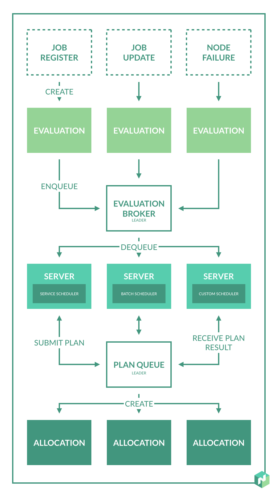
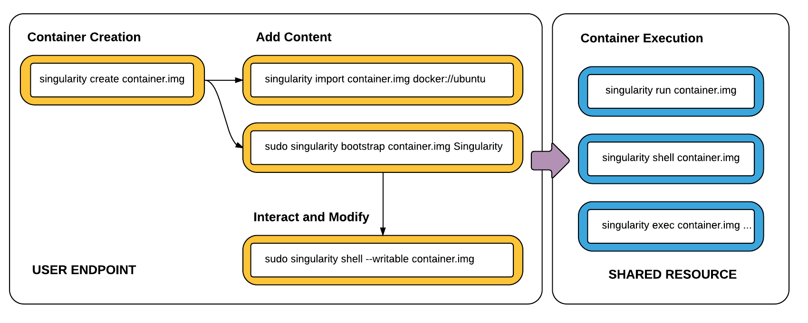

# Singularity on Nomad

The Singularity on Nomad tutorial documents how to deploy [Singularity](http://singularity.lbl.gov/) on [Nomad](https://www.nomadproject.io/). The following diagram provides a high level overview of the Nomad architecture.

overview of the Singularity architecture.

The following components will be deployed to a minimal Nomad cluster (1 server + clients)

* [Consul](https://www.consul.io/) 0.9.3
* [Nomad](https://www.nomadproject.io/) 0.6.3
* [Singularity](http://singularity.lbl.gov/) 2.3.2

## Motivation

[Nomad](https://www.nomadproject.io/) is focused on both long-lived services and batch workloads,
and is designed to be a platform for running large scale applications instead of just managing a queue of batch work.
Nomad supports a broader range of workloads, is designed for high availability, supports much richer constraint enforcement and *bin packing* logic which works really well with the *Singularity* philosophy.

[Singularity](http://singularity.lbl.gov/)
A container platform focused on supporting "Mobility of Compute".

Mobility of Compute encapsulates the development to compute model where
developers can work in an environment of their choosing and creation and
when the developer needs additional compute resources, this environment
can easily be copied and executed on other platforms. Additionally as
the primary use case for Singularity is targeted towards computational
portability, many of the barriers to entry of other container solutions
do not apply to Singularity making it an ideal solution for users (both
computational and non-computational) and HPC centers.

## The Container
Singularity utilizes container images, which means when you enter and
work within the Singularity container, you are physically located inside
of this image. The image grows and shrinks in real time as you install
or delete files within the container. If you want to copy a container,
you copy the image.

Using a single image for the container format, has added advantages
especially within the context of HPC with large parallel file systems
because all metadata operations within the container occur within the
container image (and not on the metadata server!).

## Mobility of Compute
With Singularity, developers who like to be able to easily control their
own environment will love Singularity's flexibility. Singularity does not
provide a pathway for escalation of privilege (as do other container
platforms which are thus not applicable for multi-tenant resources) so
you must be able to become root on the host system (or virtual machine)
in order to modify the container.

## Tutorial

* [Prerequisites](docs/Prerequisites.md)
* [Provision The Nomad Infrastructure](docs/nomad/nomad.md)
* [Provision The Consul Cluster](docs/consul/consul.md)
* [Install Singularity](docs/singularity/singularity.md)
* [Running Nomad Jobs](https://github.com/kelseyhightower/nomad-on-kubernetes/blob/master/docs/09-nomad-jobs.md)
* [Running Nomad Jobs with Singularity](docs/singularity/jobs/singularity-jobs.md)

### Contribute

We believe that sharing is important, and encouraging our peers is even more important. Part of contributing to this tutorial means respecting, encouraging and welcoming others.
<!--
EOF!
-->
